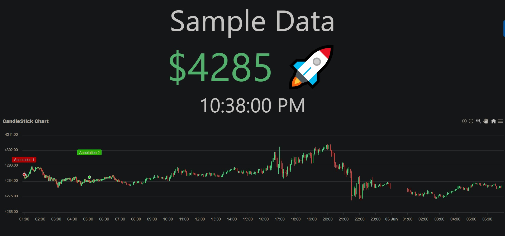

# trading_app

## Table of Contents

- [Endpoints](#endpoints)
- [Setup Guide](#setup-guide)
- [Need to reset your PostgreSQL database?](#need-to-reset-your-postgresql-database)

## Endpoints

### Front-end: [localhost:3000](http://localhost:3000/)

### Back-end: [localhost:8000](http://localhost:8000/)

## Setup Guide
### 1. Get Docker [here](https://docs.docker.com/get-docker/) or using your terminal:

- **MacOS**

        brew install --cask docker

-  **Windows**

        winget install Docker.DockerDesktop

### 2. Run the Docker Application

### 3. Clone this repository into a \<local directory> and navigate into the \<local directory>.
```
cd <projects folder>
md <local directory>
git clone <git repo link>
cd <local directory>
```

### 4. Create the necessary Docker volume

```
docker volume create pg_trading_data
docker volume create pg-admin_trading_data
```

### 5. Build your Docker images

```
docker compose build
```

### 6. Spin up your Docker containers

```
docker compose up
```

### 7. The trading web app is ready and accessible by visiting [localhost:3000](http://localhost:3000/)


### 8. The trading app API is accessible at [localhost:8000](http://localhost:8000/)



## Need to reset your PostgreSQL database?

### 1. Stop all running Docker services/containers

### 2. Prune your Docker containers

```
docker container prune -f
```

### 3. Delete your existing volumes

```
docker volume rm pg_trading_data
docker volume rm pg-admin_trading_data
```

### 4. Recreate the necessary volumes

```
docker volume create pg_trading_data
docker volume create pg-admin_trading_data
```

### 5. Restart your Docker containers

```
docker compose up
```

## Installing Pre-commit
#### Instructions from https://pre-commit.com/

### 1. Install Pre-commit

- Using pip:

        pip install pre-commit

- In a python project, add the following to your requirements.txt (or requirements-dev.txt):

        pre-commit

- As a 0-dependency zipapp:

  - locate and download the .pyz file from the github releases
  - run python pre-commit-#.#.#.pyz ... in place of pre-commit ...

- Using homebrew:

        brew install pre-commit

- Using conda (via conda-forge):

        conda install -c conda-forge pre-commit

### 2. Install the git hook scripts

- run `pre-commit install` to set up the git hook scripts

### 3. Now pre-commit will run automatically on git commit!
